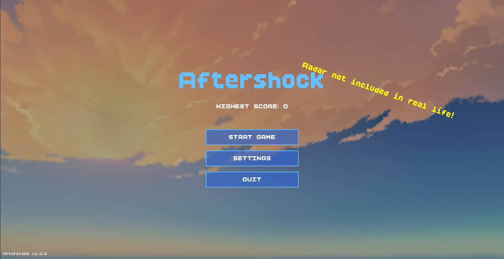

# Aftershock  -  PyWeek 40

[](https://www.python.org/downloads/)
[](https://www.raylib.com/)
[](https://opensource.org/licenses/MIT)
[](https://pyweek.org/40/)



A thrilling 3D aerial combat game created for PyWeek 40 with the theme "Skyscraper City". Take control of a fighter jet and defend the city against waves of enemy aircraft in this action-packed arcade shooter.

🔹 **Fast-paced aerial combat**  
🔹 **Dynamic city environment**  
🔹 **Immersive 3D audio**  
🔹 **Challenging AI opponents**


## Features

- Dynamic camera with smooth movement and cinematic effects
- Splash texts!
- Multiple enemy types with unique behaviors
- High score system
- Some hardcore enemy AI
- Immersive audio with 3D sound positioning
- Multiple game states (Menu, Settings, Gameplay, Game Over)
- Quite a few bugs too xD

## Installation

### Prerequisites

- Python 3.8+
- uv (Python package manager)

Get uv:
   ```bash
   # Linux and MacOS
   curl -LsSf https://astral.sh/uv/install.sh | sh

   # Windows
   powershell -ExecutionPolicy ByPass -c "irm https://astral.sh/uv/install.ps1 | iex"
   ```

### Setup

1. Clone the repository:
   ```bash
   git clone https://github.com/Walkercito/PyWeek-40.git
   cd PyWeek-40
   ```

2. Install dependencies using uv:
   ```bash
   uv sync
   ```

3. Run the game:
   ```bash
   uv run src/main.py
   ```

## Controls

### Flight Controls
- **MOUSE**: PSteer the aircraf
- **W/S**: Accelerate/Decelerate
- **Left Click**: Fire primary weapon
- **TAB**: Toggle advanced radar
- **Left Shift**: Engage boost
- **1, 2, 3**: Switch weapon type (Normal, Heavy, Rapid)
- **P (in-game)**: Pauses the game
- **ESC**: Closes the game

## Gameplay

### Objectives
- Defeat enemy aircraft while protecting the city
- Survive as long as possible to achieve a high score
- Avoid crashing into buildings or the ground


## Technical Details

### Built With
- Python 3.12
- raylib 5
- Custom audio system with 3D sound positioning

## Development

### Building Executable
To build a standalone executable use **pyinstaller** or **auto-py-to-exe**.

## License

MIT License - See [LICENSE](LICENSE) for details.

## Acknowledgments

- raylib developers for the amazing game development library
- Discord Python Server for hosting the PyWeek

I worked on this while working at my job, so it's not the best game ever, but it's fun to play!

---

Made with ❤️ for PyWeek 40 by Walkercito